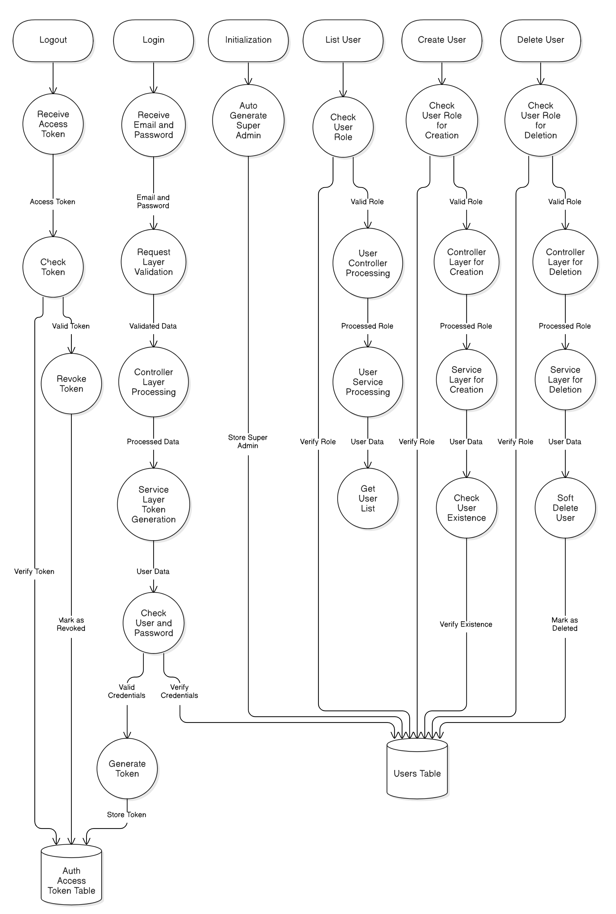

### Interpretasi Diagram Alur Data

Data Flow Diagram ini menggambarkan alur kerja sistem otentikasi dan manajemen pengguna dalam aplikasi. Berikut adalah aliran utama dari proses authentikasi dan manajemen user yang ada di service Backend ini:

1. **Logout**

    - Menerima access token dari pengguna.
    - Memeriksa validitas token.
    - Jika valid, token akan dicabut (revoked) dari sistem.
    - Token yang dicabut ditandai di dalam tabel `Auth Access Token Table`.

2. **Login**

    - Menerima email dan password pengguna.
    - Memvalidasi permintaan melalui request layer.
    - Memproses data di controller layer.
    - Service layer menghasilkan token otentikasi baru.
    - Sistem memeriksa kredensial pengguna.
    - Jika kredensial valid, sistem menghasilkan token dan menyimpannya di `Auth Access Token Table`.

3. **Inisialisasi**

    - Sistem secara otomatis membuat akun Super Admin saat aplikasi pertama kali dijalankan.
    - Super Admin ini akan disimpan di dalam `Users Table`.

4. **List User**

    - Sistem memeriksa role pengguna sebelum mengakses daftar pengguna.
    - Jika valid, proses berlanjut ke controller layer.
    - Service layer mengambil daftar pengguna dari `Users Table`.

5. **Create User**

    - Sistem memeriksa apakah pengguna memiliki role yang valid untuk membuat user baru.
    - Jika valid, controller layer memproses permintaan pembuatan user.
    - Service layer melakukan pengecekan apakah user sudah ada.
    - Jika belum ada, user baru disimpan di dalam `Users Table`.

6. **Delete User**
    - Sistem memeriksa apakah pengguna memiliki role yang valid untuk menghapus user.
    - Jika valid, controller layer memproses permintaan penghapusan user.
    - Service layer melakukan soft delete dengan menandai user sebagai terhapus di `Users Table`.
